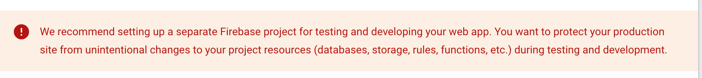

# multilingual-url
This project is a simple Firebase Hosting app with multilingual-urls. 
The develeopers test the features on their local machines. Then they push their features to a branch.

When they create a PR to the main, Github Actions workflows will run and it will create a preview channel to test. If there is not problem with the PR, it will be merged into the main.

The main branch deploys to the staging environment directly with the Github Actions workflow. If the staging environment is successful, staging environment will be cloned to the prod manually. Automatical changes are not desired on the prod environment usually.

```bash
# cloned preview channel from the staging project to the prod live firebase
firebase hosting:clone deneme-cd44d:pr1-test2 multilingual-url:live
```

There are two environments:
- [Staging](https://deneme-cd44d.web.app/)
- [Prod](https://multilingual-url.web.app/)

Both of them are different Firebase projects because we don't want them to use the other's resources accidentaly. As explained below.



Firebase Github Actions integration is used. [The documentation](https://firebase.google.com/docs/hosting/github-integration). This integration creates two Github Actions workflows. One of them deploys project to the live when there is a push to the main branch. The other one creates a preview when there is a PR. Github Actions comment the preview channel's url. [Example](https://github.com/MercerFrey/multilingual-url/pull/1#issuecomment-1798591603)

Directory structure is below. The pages with the different languages under their subdirectories according to the [Firebase i18n documentation](https://firebase.google.com/docs/hosting/i18n-rewrites). It automatically finds the correct page to show. For example if my browser setting for the language is Turkish, it will check the accepted-languages header and try to return the html file with the same language. If it could not find any, it will return the /dist/app/index.html. If there is an error, it will return /dist/app/404.html.


## Steps
1) Initialize the Firebase Hosting project with the built-in Github integration.
2) Create simple html files
3) Add i18n file structure
4) Create Prod project and clone staging to the prod

## TODO 
- It is possible to create [Predeploy and Postdeploy](https://firebase.google.com/docs/hosting/test-preview-deploy#hooks). Predeploy runs before the deploy process and if there is a problem deploy is not successful. Postdeploy runs after the deploy process and if the deployment fails it will not trigger. 
- Similar updates can be done on the Github Actions as well.  

